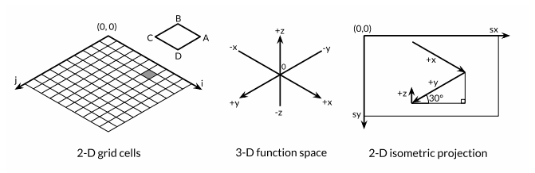

# 1.4 GIF 动画
这篇展示 Go 标准库的图像包的使用。创建一系列的位图图像，然后将位图序列编码为 GIF 动画。示例要创建的图像叫做**利萨如图形**（Lissajous-Figure）,是20世纪60年代科幻片中的纤维状视觉效果。利萨如图形是参数化的二维谐振曲线，如示波器x轴和y轴馈电输入的两个正弦波。  

## 示例代码
先放上完整的示例：
```go
// ch1/lissajous
```

## lissajous函数
函数有两个嵌套的循环。外层有64个迭代，每个迭代产生一帧。创建一个201×201大小的画板，使用黑白两种颜色。所有的像素值默认设置为0，就是默认的颜色，这里就是白色。每一个内存循环通过设置一些像素为黑色产生一个新的图像。结果用append追加到anim的帧列表中，并且指定80ms的延迟。最后，帧和延迟的序列被编码成GIF格式，然后写入输出流out。  
内层循环运行两个振荡器。x方向的振荡器是正弦函数，y方法也是正弦化的。但是它的频率频率相对于x的震动周期是0~3之间的一个随机数。它的相位相对于x的初始值为0，然后随着每个动画帧增加。该循环在x振荡器完成5个完整周期后停止。每一步它都调用SetColorIndex将对应画板上画的(x,y)位置设置为黑色，即值为1。  

## 运行
main函数调用 lissajous 函数，直接写到标准输出，然后用输出重定向指向一个文件名，就生成gif文件了：
```
$ go build gopl/ch1/liaasjous
$ ./lissajous >out.gif
```
不过windows貌似不支持gif了。加上web参数调用程序，直接打开浏览器就能查看，每次刷新都是一张新的图形。

# 3.2 浮点数
该篇举了一个浮点绘图运算的例子。根据传入两个参数的函数 z=f(x,y)，绘出三维的网线状曲面，绘制过程中运用了可缩放矢量图形（Scalable Vector Graphics， SVG），绘制线条的一种标准XML格式。

## 示例代码
先放上完整的示例：
```go
// ch3/surface/web
```

## 说明
corner函数返回两个值，构成网格单元其中一个格子的坐标。  
理解这段程序需要一些几何知识。这段程序本质上是三套不同坐标系的相互映射，见下图。首先是一个包含 100×100 个单元的二维网络，每个网络单元用整数坐标 (i, j) 标记，从最远处靠后的角落 (0, 0) 开始。从后向前绘制，就如左侧的图，因而后方的多边形可能被前方的遮住。  
  
再看中间的图，在这个坐标系内，网络由三维浮点数 (x, y, z) 决定，其中x和y由i和j的线性函数决定，经过坐标转换，原点处于中央，并且坐标系按照xyrange进行缩放。高度值z由曲面函数 f(x,y) 决定。  
最右边的图，这个坐标系是二维成像绘图平面（image canvas），原点在左上角。这个平面中点的坐标记作 (sx, sy)。这里用等角投影（isometric projection）将三维坐标点 (x, y, z) 映射到二维绘图平面上。若一个点的x值越大，y值越小，则其在绘图平面上看起来就越接近右方。而若一个点的x值或y值越大，且z值越小，则其在绘图平面上看起来就越接近下方。纵向 (x) 与横向 (y) 的缩放系数是由30度角的正弦值和余弦值推导而得。z方向的缩放系数为0.4，是个随意决定的参数值。  
回到左边那张图的小图，二维网络中的单元由main函数处理，它算出多边形ABCD在绘图平面上四个顶点的坐标，其中B对应 (i, j) ，A、C、D则为其它三个顶点，然后再输出一条SVG指令将其绘出。  

# 复数
该篇通过复数的计算，生成 PNG 格式的分形图。

## 复数说明
Go具备了两种大小的复数 complex64 和 complex128，二者分别由 float32 和 float64 构成。内置的 complex 函数根据给定的实部和虚部创建复数，而内置的 real 函数和 imag 函数则分别提取复数的实部和虚部：
```go
var x complex128 = complex(1, 2)  // 1+2i
// x := 1 + 2i
var y complex128 = complex(3, 4)  // 3+4i
// y := 3 + 4i
fmt.Println(x*y)  // -5+10i
fmt.Println(real(x*y))  // -5
fmt.Println(imag(x*y))  // 10

fmt.Println(1i * 1i)  // -1
```

## 示例代码
先放上完整的示例：
```go
// ch3/mandelbrot
```
这个程序用 complex128 运算生成一个 Mandelbrot 集。

## 说明
两个嵌套循环在 1024×1024 的灰度图上逐行扫描每个点，这个图表示复平面上-2~+2的区域，每个点都对应一个复数，该程序针对各个点反复迭代计算其平方与自身的和，判断其最终能否超出半径为2的圆（取模）。然后根据超出边界所需的迭代次数设定点的灰度。在设定的迭代次数内没有超出的那部分点，这些点属于 Mandelbrot 集，就是黑色的内些部分。最后输出PNG图片。

## 输出到Web页面
这次将PNG写到img标签里，并且不生成图片文件，而是用base64对图片进行编码：
```go
// exercise3/e6
```
这里还增加一个的图形，运用牛顿法求某个函数的复数解（z^4-1=0）。原来的图形这次做成了彩图。